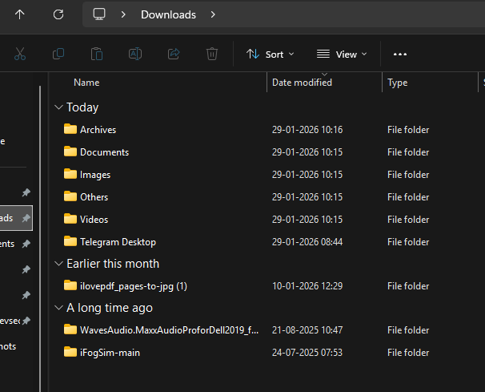
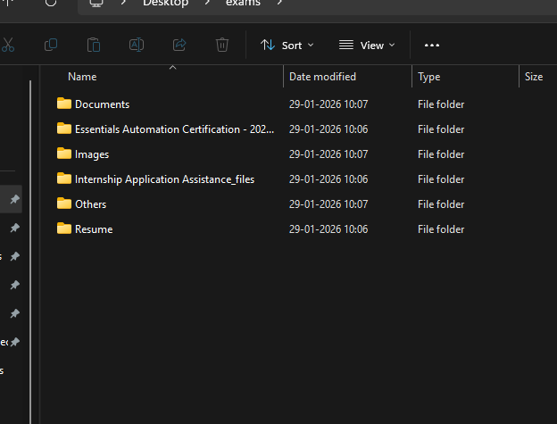

# File Organizer Script (Python)

A Python automation script that organizes files in a directory into
categorized folders based on their file extensions. The project
demonstrates filesystem handling, automation logic, and clean program
design.

---

## Overview
Manually organizing files in folders like Downloads or Desktop is
time-consuming and error-prone. This script automates the process by
scanning a target directory, identifying file types, and moving files
into appropriate folders such as Images, Documents, Videos, and Others.

---

## How It Works (High-Level Flow)
1. Scan all items in the target directory
2. Identify files and extract their extensions
3. Map extensions to predefined categories
4. Create category folders if they do not exist
5. Move files into the appropriate folders

---

## Folder Categorization
The script currently organizes files into the following categories:

- **Images** → `.jpg`, `.jpeg`, `.png`
- **Documents** → `.pdf`, `.docx`, `.txt`
- **Videos** → `.mp4`, `.mkv`
- **Archives** → `.zip`, `.rar`
- **Others** → Any unsupported or unknown extensions

This structure can be easily extended by modifying the category mapping.

---

## Output Example

Below is an example showing files automatically organized into
category folders after running the script:
 downloads:

 exams:

---

## Tech Stack
- Python
- `os` module (directory and file handling)
- `shutil` module (file movement)

---

## Key Concepts Used
- File system traversal
- File extension parsing
- Dictionary-based classification
- Conditional logic
- Automation scripting
- Safe file movement

---

## Design Decisions
- **Dictionary-based mapping** is used for file categories to ensure
  scalability and easy extensibility.
- **File-based checks** prevent directories from being mistakenly moved.
- **Automatic folder creation** avoids manual setup and improves usability.

---

## Complexity Analysis
Let `n` be the number of files in the target directory.

- Directory scan: **O(n)**
- File classification: **O(1)** per file
- Overall time complexity: **O(n)**

The script is efficient for typical personal directories.

---

## Limitations
- Does not handle duplicate file names
- Does not organize subdirectories recursively
- No dry-run or preview mode

These limitations are intentional to keep the script simple and focused.

---

## Possible Improvements
- Add duplicate file handling
- Support recursive folder organization
- Add command-line arguments
- Implement a dry-run mode
- Log moved files for audit purposes

---

## What I Learned
- Automating repetitive tasks using Python
- Working with the operating system’s file structure
- Designing scalable classification logic
- Writing clean, modular automation scripts
